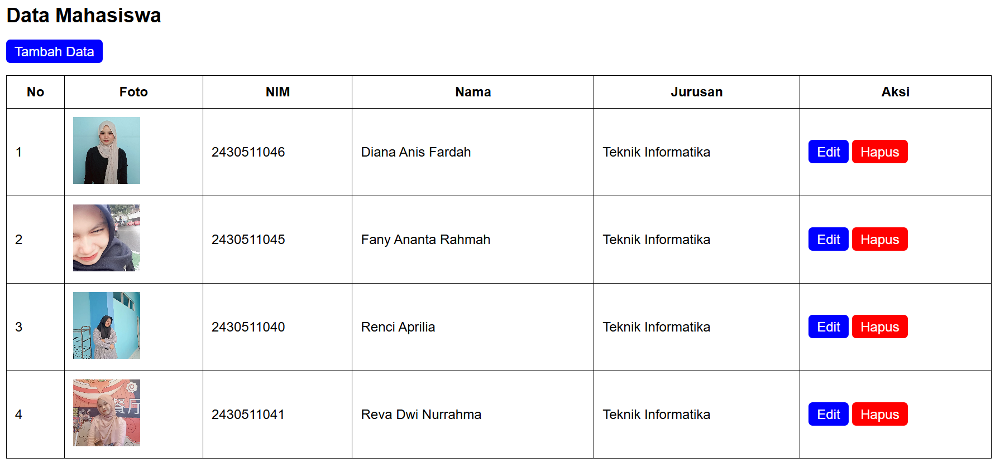
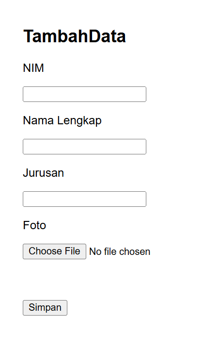

# CRUD Data Mahasiswa 
## Deskripsi Project 
CRUD Data Mahasiswa adalah aplikasi web sederhana berbasis PHP Native 
dan MySQL yang digunakan untuk mengelola data mahasiswa. Aplikasi ini 
dibuat sebagai proyek ujian praktik dengan konsep CRUD (Create, Read, 
Update, Delete). 
Aplikasi memungkinkan pengguna untuk: 
- Menambahkan data mahasiswa 
- Menampilkan daftar mahasiswa 
- Mengedit data mahasiswa 
- Menghapus data mahasiswa 
- Mengunggah foto profil mahasiswa 
--- 
## Fitur Utama 
- Menampilkan data mahasiswa dalam bentuk tabel 
- Upload foto mahasiswa 
- Validasi form menggunakan JavaScript 
- Konfirmasi hapus data 
- Penyimpanan data menggunakan MySQL 
- Tampilan sederhana menggunakan HTML dan CSS native 
--- 
## Teknologi yang Digunakan 
- HTML 
- CSS 
- JavaScript 
- PHP Native 
- MySQL 
- Laragon 
--- 
## Struktur Data Mahasiswa 
Data yang dikelola pada aplikasi ini meliputi: 
| Field | Keterangan | 
|---|---| 
| NIM | Nomor Induk Mahasiswa | 
| Nama Lengkap | Nama mahasiswa | 
| Jurusan | Program studi mahasiswa | 
| Foto | Foto profil mahasiswa | 
--- 
## Struktur Folder Project 
```txt 
crud-mahasiswa/ 
│ 
├── uploads/ 
├── ss_web/
├── koneksi.php 
├── index.php 
├── form.php 
├── simpan.php 
├── hapus.php 
├── style.css 
├── crud_mahasiswa.sql 
└── README.md
---
## Screenshot Website

### Halaman Utama


### Halaman Form

